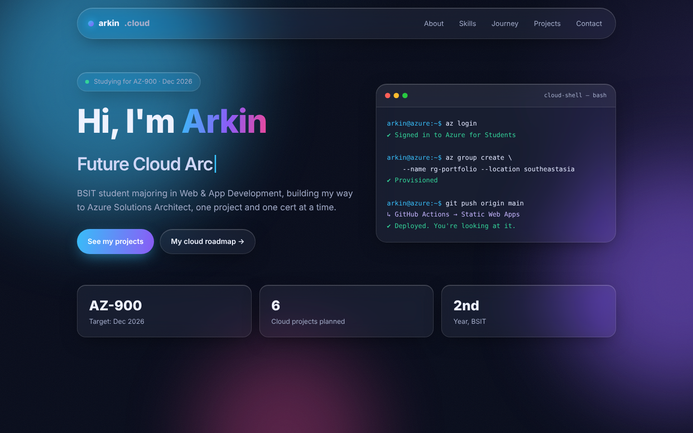

# ☁️ Arkin · Cloud Portfolio

My personal site and **Project 1** of my Cloud Journey: a React + Vite site with a glassmorphism UI, hosted on **Azure Static Web Apps** and redeployed automatically by **GitHub Actions** on every push.

> **Live site:** _coming soon (Week 5–6)_ <!-- TODO: paste your Azure URL here -->



---

## 🔗 Quick links

| What | Link |
| --- | --- |
| Live site | _TODO after deploy_ |
| Azure portal | https://portal.azure.com |
| Azure for Students | https://azure.microsoft.com/free/students/ |
| AZ-900 study guide | https://learn.microsoft.com/credentials/certifications/resources/study-guides/az-900 |
| Static Web Apps docs | https://learn.microsoft.com/azure/static-web-apps/ |
| React docs | https://react.dev |
| Vite docs | https://vite.dev |
| Node.js (download LTS) | https://nodejs.org |
| Git (download) | https://git-scm.com |

## 🧰 Tech stack

- **Frontend:** React 19, Vite, plain CSS (glassmorphism, no UI library)
- **Hosting:** Azure Static Web Apps (Free plan)
- **CI/CD:** GitHub Actions
- **Backend / database:** none. It's a static site.

---

## ▶️ Open and run it (VS Code)

**Need first:** Node.js LTS and Git installed (links above).

1. VS Code → **File → Open Folder…** → pick `01-portfolio-static-web-app`
2. Open the terminal: **Ctrl + `**
3. Run:

```bash
npm install      # first time only, downloads React + Vite into node_modules
npm run dev      # starts the site
```

4. Ctrl + click **http://localhost:5173**. Edits show up instantly when you save.
5. Stop the server with **Ctrl + C**.

| Command | What it does |
| --- | --- |
| `npm run dev` | Local dev server with hot reload |
| `npm run build` | Production build into `dist/` (what Azure deploys) |
| `npm run preview` | Preview the production build locally |

---

## ⬆️ Push to GitHub

### First time

1. On GitHub: **New repository** → name it `portfolio` → Public → **don't** add a README (this folder already has one) → Create.
2. In the VS Code terminal, inside this folder:

```bash
git init
git add .
git commit -m "Initial portfolio: React + Vite glassmorphism site"
git branch -M main
git remote add origin https://github.com/YOUR-USERNAME/portfolio.git
git push -u origin main
```

`node_modules/` and `dist/` are already in `.gitignore`, so they won't be uploaded.

### Every time after

```bash
git add .
git commit -m "Describe what you changed"
git push
```

---

## ✏️ Make it yours

Almost everything is in **`src/data/content.js`**: name, links, skills, cert progress, projects.

- Passed a cert? Change its `status` to `'done'`.
- New project? Add an object to `projects`.
- Colors / blur / roundness → the top of `src/index.css` (`:root` tokens).

## 📁 Project structure

```
01-portfolio-static-web-app/
├── public/
│   ├── favicon.svg
│   └── staticwebapp.config.json   ← Azure routing + security headers
├── src/
│   ├── data/content.js            ← ✏️ all the site's text and data
│   ├── components/
│   │   ├── Navbar.jsx             ← glass navbar + mobile menu
│   │   ├── Hero.jsx               ← typing headline + Cloud Shell card
│   │   └── Sections.jsx           ← About, Skills, Journey, Projects, Contact
│   ├── hooks/useReveal.js         ← scroll animations + card spotlight
│   ├── App.jsx                    ← puts all sections together
│   ├── main.jsx                   ← React entry point
│   └── index.css                  ← all styles
├── docs/preview.png               ← screenshot for this README
├── index.html
└── package.json
```

---

## 🚀 Deploy to Azure (Weeks 5–6)

1. Push to GitHub first (above).
2. Azure portal → **Create a resource → Static Web App**.
   - Subscription: **Azure for Students**
   - Resource group: new → `rg-portfolio`
   - Plan: **Free**
   - Source: **GitHub** → your `portfolio` repo, branch `main`
   - Build preset: **React**
   - App location: `/` · Output location: `dist`
3. Azure adds a workflow file in `.github/workflows/`. Run `git pull` so your laptop has it too.
4. Open the URL Azure gives you, then paste it at the top of this README. ✅

### Architecture

```
You ── git push ──▶ GitHub ──▶ GitHub Actions (npm run build)
                                     │
                                     ▼
                     Azure Static Web Apps (global CDN) ──▶ Visitors
```

**Monthly cost:** ₱0 on the Free plan.

---

## 🛠️ Troubleshooting

| Problem | Fix |
| --- | --- |
| `npm` is not recognized | Install Node.js LTS, then **restart VS Code**. |
| `npm.ps1 cannot be loaded because running scripts is disabled` | In PowerShell run `Set-ExecutionPolicy -Scope CurrentUser RemoteSigned`, or switch the VS Code terminal to **Command Prompt**. |
| `git push` asks to sign in | Sign in with your GitHub account in the pop-up (Git Credential Manager). |
| Port 5173 already in use | Another dev server is still running. Close that terminal, or Vite will pick the next port. |
| Deployed site is blank / 404 | Check the Output location is `dist` in the Static Web App's workflow file. |

---

## 📝 My notes / what I learned

<!-- Write a few lines each week. Interviewers love this section. -->

- **Week 5:** 
- **Week 6:** 
